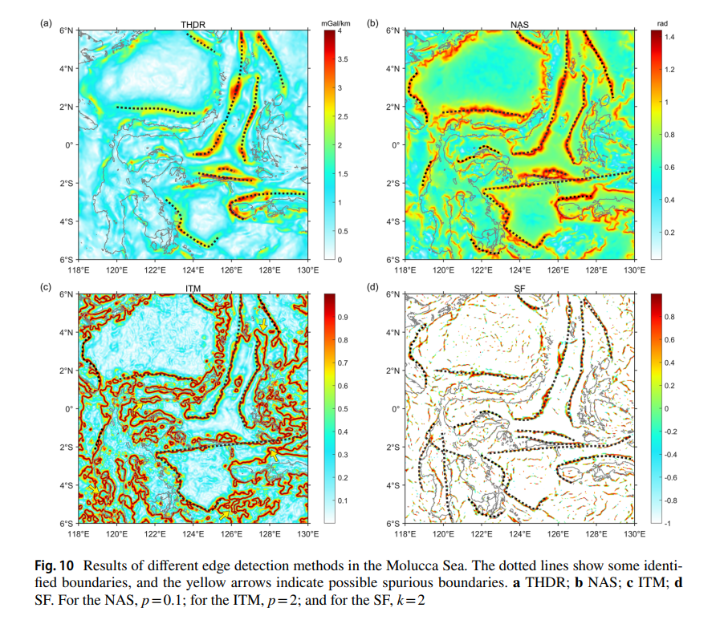

# Literature Review

Approaches or solutions that have been tried before on similar projects.

**Summary of Each Work**:

- **Source 1**: [New Kinematic Model of the Early Opening of the
Equatorial Atlantic Realm (Lesourd-Laux et al., 2025)]

  - **[Link](https://agupubs.onlinelibrary.wiley.com/doi/10.1029/2024TC008713?af=R)**  
  
  - **Objective**:  
This study aims to develop a new kinematic model for the early opening of the Equatorial Atlantic Ocean, addressing challenges posed by limited magnetic data and complex fracture zones. Its goal is to re-evaluate tectonic settings, including continental margins and the Cretaceous Jurassic Line (CJL). The research also intends to improve understanding of the triple junction's evolution between the Equatorial Atlantic, Central Atlantic, and proto-Caribbean oceans, and its implications for Lesser Antilles Arc subduction hazards.

  - **Methods**:  
The researchers used GPlates and PyGPlates software to create their kinematic reconstruction. They built upon the Moulin et al. (2010) South Atlantic model, updating timing of rotations based and adjusting continental block boundaries in northern South America. The methods used were as follows:  
  
    a) Gravity and bathymetry data to identify major tectonic features like fracture zones (FZs) and continental margins  

    b) Multi-Channel Seismic (MCS) and structural data to define continental margin types and their boundaries (COBs)  

    c) Gravity-derived Moho depth and global sedimentary thickness maps for inland plate boundaries  
  
    The study used identified FZs, especially the Cretaceous Jurassic Line (CJL), to reconstruct the ocean's opening direction and initial continental fits. Seismic         data helped interpret the CJL's structure and sedimentary infill. The model proposes a two-phase rifting process, with distinct plate movements in each phase,           constrained by known timings and South Atlantic rotations.

  - **Outcomes**:  
The study presents a new kinematic model for the Equatorial Atlantic, identifying two regions divided by the St Paul Fracture Zone. It outlines a two-phase rifting history: the first phase involved strike-slip movement between West Africa and the Guyana block during the Early Cretaceous, while the second phase saw northward movements leading to oblique rifting. The Cretaceous Jurassic Line (CJL) is identified as an Early Cretaceous transform fault that later became a rift zone, with chaotic sediments from this rifting. Additionally, the Amazon basins acted as a boundary for early plate movements. The model suggests significant implications for the Lesser Antilles Arc subduction zone, including revised oceanic boundaries and the subduction of Equatorial Atlantic crust around 3 million years ago, linked to intermediate earthquakes due to dehydration in the lithosphere.  
  
  - **Relation to the Project**:  
This reference is a key part of my internship, as it helps define a new understanding of the North American-South American (NA-SA) plate boundary. The CJL offers a fresh look at how the North American, South American, and African plates separated. My goal during this internship is to support and prove this idea.
  
- **Source 2**: [Residual Bouguer satellite gravity anomalies reveal basement grain and structural elements of the Vøring Margin, off Norway (Christian Berndt, 2002)]

  - **[Link](https://oceanrep.geomar.de/id/eprint/19128/)**

  - **Objective**:  
The objective of this study was to map and interpret deep crustal and basement structures of the Vøring Margin, offshore Norway, by generating a high-resolution residual Bouguer gravity anomaly map from satellite gravity and bathymetric data. The aim is to improve understanding of regional geological features such as basins, highs, and faults, and to support seismic interpretation in a key hydrocarbon exploration area.

  - **Methods**:  
     a) Acquired satellite-derived free-air gravity data and combined it with ship-based bathymetric measurements.  

     b) Applied a 3D Bouguer correction to account for the gravitational effect of water, using a sediment–water density contrast of 1400 kg/m³, deemed appropriate for Vøring Basin conditions.  

     c) Filtered the gravity data to isolate wavelength bands between 10 and 190 km, which enhance signals from intermediate to deep crustal structures.

     d) Interpreted the residual gravity anomalies in relation to known geological features and potential new structural elements.
    
  - **Outcomes**:  
The residual gravity anomaly map revealed strong negative anomalies over deep sedimentary basins (e.g., Hel Graben, Rås Basin) and strong positive anomalies over basement highs and metamorphic complexes (e.g., Sandflesa High, Utgard High, Gjallar Ridge). It highlighted two dominant structural trends—SW–NE and N–S—and confirmed known elements while uncovering new complexities, such as internal variations within the Gjallar Ridge. Tertiary domes were associated with negative anomalies, and the study confirmed that satellite-derived gravity maps are effective tools for regional structural interpretation.

  - **Relation to the Project**:  
The article describes a very similar processing methodology to the one used during this project, giving a valuable reference and help in deeper understanding of the whole process.

- **Source 3**: [Tools for Edge Detection of Gravity Data: Comparison and Application to Tectonic Boundary Mapping in the Molucca Sea (Liu et al., 2022)]

  - **[Link](https://link.springer.com/article/10.1007/s10712-023-09784-x)**
  
  - **Objective**:  
The objective of this article is to systematically evaluate and compare the performance of 28 edge detection techniques used to interpret gravity data for identifying geological boundaries. The goal was to determine which methods are most effective for resolving complex subsurface structures, particularly in noisy data environments, and to apply these insights to real-world tectonic analysis in the Molucca Sea.

  - **Methods**:  
The study reviewed existing edge detection techniques and tested them on synthetic 2.5D and 3D gravity models with known boundaries, both with and without added noise. Detectors were grouped into three categories: sequential combination methods, ratio-based methods, and mixed-class methods. Their performance was assessed in terms of boundary resolution, noise resistance, and reliability. The most effective techniques were then applied to actual gravity data from the Molucca Sea, integrated with seismic information (earthquake locations and focal mechanisms) to interpret regional tectonics.

  - **Outcomes**:  
The study found that edge detectors vary widely in performance; traditional methods like THDR and ASA showed poor resolution, while first-derivative-based filters like VDR and TA often introduced false boundaries in complex zones. Mixed-class detectors such as LTHG, EHGA, and SF consistently outperformed others, offering sharper boundary definition, better amplitude balancing between shallow and deep sources, and greater resistance to noise. However, even these methods were sensitive to data noise, highlighting the trade-off between noise reduction (e.g., via upward continuation) and resolution. Application to the Molucca Sea revealed four deep tectonic boundaries and five earthquake depth zones, suggesting tectonic control from both multi-plate subduction and the PKMSSF fault system.  
                                       
  - **Relation to the Project**:
This study is a good reference for a comparative approach of different edge detection methods, identifying the possible limitations, and deepening the understanding of edge detection in general.

    
    
