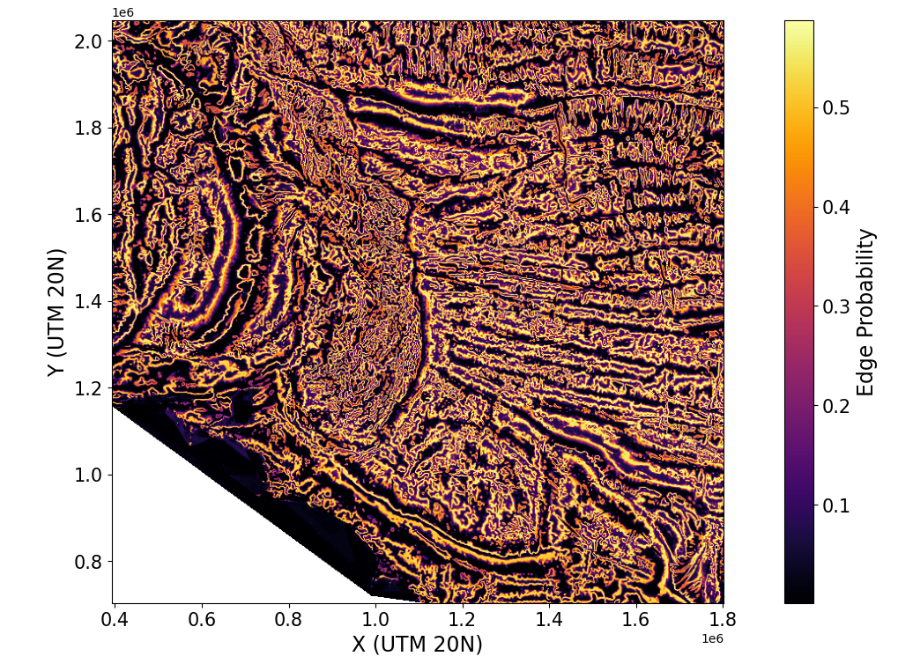

# [Edge Detection_LesAnt]

## Repository Link

[https://github.com/Aneczka00/EdgeDetection_LesAnt]

## Description

[This project aims to apply edge detection techniques to gravity data from the Caribbean region — specifically focusing on the area stretching from the Lesser Antilles to the Demerara Plateau. The goal is to identify sharp edges in the Bouguer anomaly data that could indicate significant geological features. This work is part of an internship project, with a particular focus on detecting structures that may suggest the presence of a Cretaceous-Jurassic Line (CJL). Identifying such features could contribute to a better understanding — and potentially a redefinition — of the South American–North American (SA–NA) plate boundary. By using a machine learning approach, this project hopes to enhance the detection of edges in the data and support more accurate geological interpretations.]

## Documentation

1. **[Literature Review](0_LiteratureReview/README.md)**
2. **[Dataset Characteristics](1_DatasetCharacteristics/exploratory_data_analysis.ipynb)**
3. **[Baseline Model](2_BaselineModel/baseline_model.ipynb)**
4. **[Model Definition and Evaluation](3_Model/model_definition_evaluation)**
5. **[Presentation](4_Presentation/README.md)**

## Cover Image

